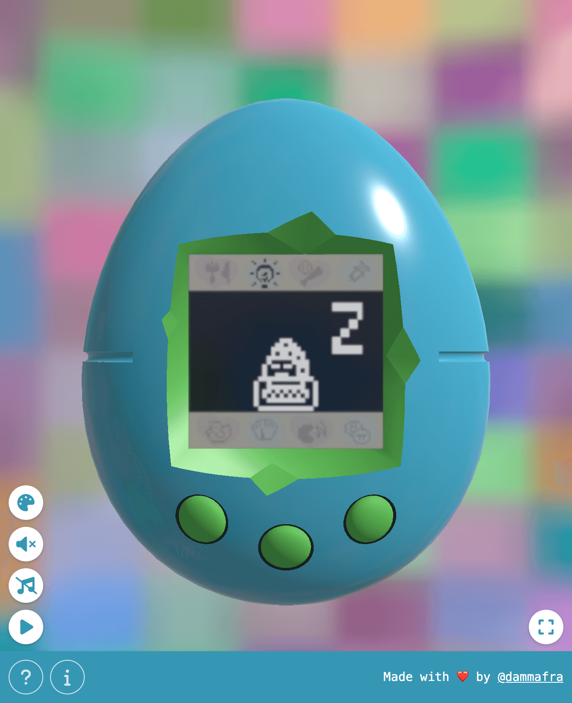
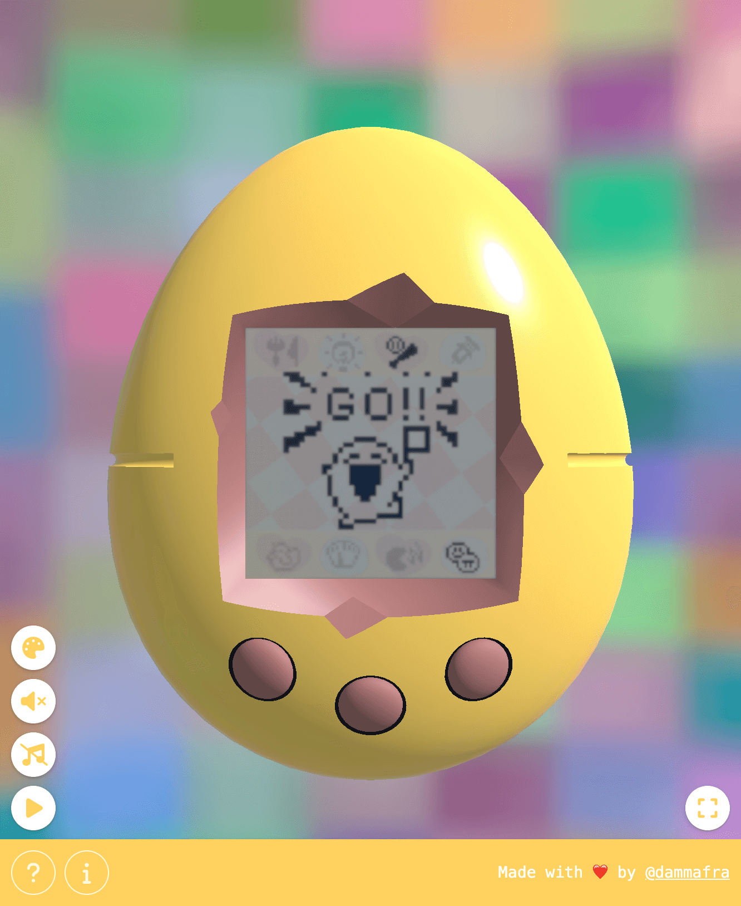
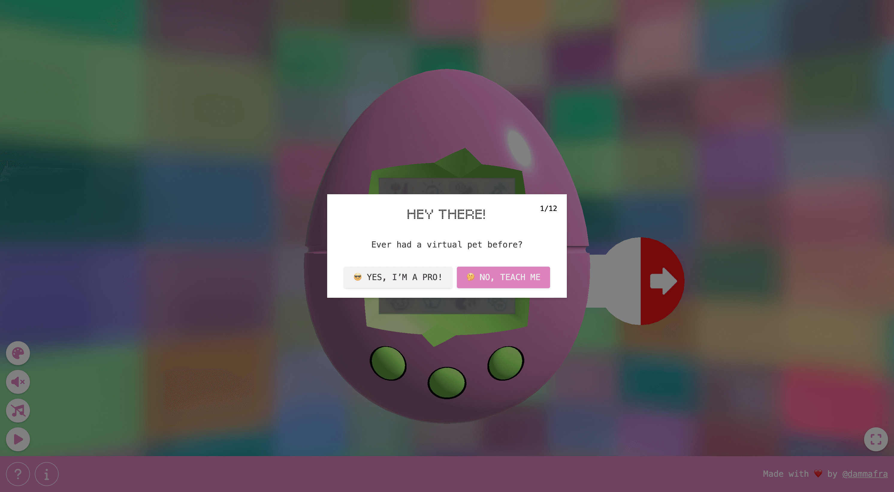
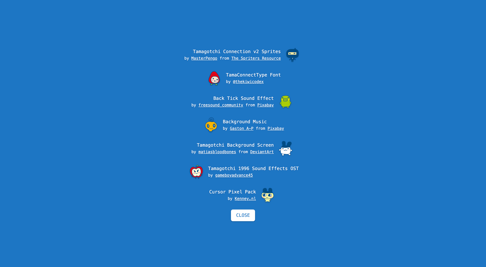

# 🥚 Dammagotchi


> 🥉 3rd place in the [Three.js Journey Challenge 016](https://threejs-journey.com/challenges/016-tamagotchi)

> Try it live here 👉 [dammagotchi.vercel.app](https://dammagotchi.vercel.app)

I grew up with Tamagotchi and wanted to faithfully recreate the original experience. My goal is to replicate how the classic virtual pet was, complete with its life cycle, care mechanics, and pixelated charm.

## Technologies Used

- [Three.js](https://threejs.org/) (3D rendering)
- [three-bvh-csg](https://github.com/gkjohnson/three-bvh-csg) (3D modeling)
- [Tweakpane](https://tweakpane.github.io/docs/) (Debug)
- [Shepherd.js](https://www.shepherdjs.dev/) (Tutorial)
- [@yomotsu/camera-controls](https://github.com/yomotsu/camera-controls)
- [Tailwind](https://tailwindcss.com/)
- [iro.js](https://iro.js.org/) (Color Picker)

## Setup

```bash
# Install dependencies (only the first time)
npm install

# Run the local server at localhost:5173
npm run dev

# Build for production in the dist/ directory
npm run build
```

## Features

### Life Cycle

The pet follows a full life cycle, starting as an egg and evolving into different forms. Over time, it grows, matures, and reaches the end of its lifespan.

| Egg                                                        |                                                                | Baby                                                     |
| ---------------------------------------------------------- | -------------------------------------------------------------- | -------------------------------------------------------- |
|        |  |    |
| Child                                                      | Teen                                                           | Adult                                                    |
|    |          |  |
| Senior                                                     | Death                                                          |
|  |        |

### Needs

Your pet has various needs that must be managed, including hunger, happiness, sleep, cleanliness, illness, and discipline. Ignoring these factors can lead to negative consequences, affecting the pet’s well-being.

| Feed                                                | Sleep                                               | Illness                                                 |
| --------------------------------------------------- | --------------------------------------------------- | ------------------------------------------------------- |
|    |  |  |
| Toilet                                              |                                                     |                                                         |
|    |  |    |
| Happy                                               | Upset                                               |                                                         |
|  |  |                                                         |

### Game: Jumping Obstacles

A built-in mini-game challenges the pet to jump over obstacles, providing an interactive way to keep it entertained. Performing well in the game can increase the pet's happiness and engagement.

|  |  |  |  |
| -------------------------------------------------- | -------------------------------------------- | ------------------------------------------------ | ------------------------------------------------ |

### Customizable Device Appearance

Users can personalize the look of their virtual Tamagotchi by changing the device color. These changes dynamically update across the UI for a cohesive visual experience.


### Reset

Just like the original Tamagotchi, there is a reset button on the back of the device, that allows to start over with a new pet. To prevent accidental resets, the button must be held down for a few seconds while a countdown confirms the action. This ensures that users don't lose progress unintentionally.


### Tutorial Introduction

A built-in tutorial guides new users through the basic interactions and mechanics, making the experience accessible for those who have never played with a Tamagotchi before.



### Time Speed

Players can control the simulation speed, adjusting how quickly time passes to fit their preferred pace of interaction. This allows for a more relaxed or more fast-paced experience depending on user preference.

### State Persistence

The game automatically saves the pet’s progress and status using local storage. This ensures that users can continue where they left off, even after closing the browser or refreshing the page.

### Mobile-Friendly

The experience is optimized for mobile devices, providing a smooth and engaging experience on smartphones and tablets. It adapts to smaller screens, ensuring easy interaction and navigation on touch interfaces.

## html2png

Using `html2canvas-pro` i created a little tool that captures HTML elements and converts them into square textures. I used it for generating menu textures and the battery plastic strip one.


You can run it using

```bash
# Run the local server at localhost:5174
npm run html2png
```

## Credits

Check out the credits section in the project for a full list of resources used



- **Tamagotchi Connection v2 Sprites**  
  by [MasterPengo](https://www.spriters-resource.com/submitter/MasterPengo/) from [The Spriters Resource](https://www.spriters-resource.com)

- **TamaConnectType Font**  
  by [@thekiwicodex](https://instagram.com/thekiwicodex)

- **Back Tick Sound Effect**  
  by [freesound_community](https://pixabay.com/users/freesound_community-46691455/?utm_source=link-attribution&utm_medium=referral&utm_campaign=music&utm_content=107822) from [Pixabay](https://pixabay.com//?utm_source=link-attribution&utm_medium=referral&utm_campaign=music&utm_content=107822)

- **Background Music**  
  by [Gaston A-P](https://pixabay.com/users/xtremefreddy-32332307/?utm_source=link-attribution&utm_medium=referral&utm_campaign=music&utm_content=145285) from [Pixabay](https://pixabay.com//?utm_source=link-attribution&utm_medium=referral&utm_campaign=music&utm_content=145285)

- **Tamagotchi Background Screen**  
  by [matiasbloodbones](https://www.deviantart.com/matiasbloodbones) from [DeviantArt](https://www.deviantart.com/)

- **Tamagotchi 1996 Sound Effects OST**  
  by [gameboyadvance45](https://www.youtube.com/watch?v=aoVaAutNJPM&ab_channel=gameboyadvance45)

- **Cursor Pixel Pack**  
  by [Kenney.nl](https://kenney.nl/)

## Going Further

There are still some missing features I have in mind:

- Death conditions based on hunger, unhappiness, and illness
- Time progression even when not actively playing
- An actual sleep/wake cycle
- Better device model with blender, with AO map
- Extract and serialize all sprites into matrices, avoiding on-the-go PNG processing

## Feedback

If you have any suggestions, feel free to reach out!

## License

© 2025 Francesco Dammacco  
This project is licensed under the GNU Affero General Public License v3.0.  
See the [LICENSE](./LICENSE) file for details.
